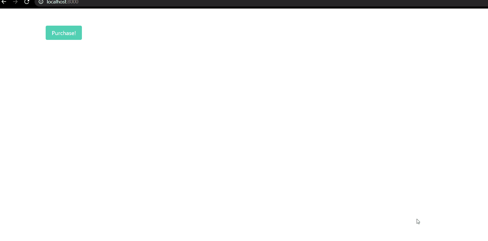

# Django Stripe Checkout

- [Django Stripe Checkout](#django-stripe-checkout)
  - [Summary](#summary)
  - [Test my repo](#test-my-repo)
  - [Project Setup](#project-setup)
  - [Add Stripe](#add-stripe)
  - [Create a Product](#create-a-product)
  - [User Flow](#user-flow)
  - [Get Publishable Key](#get-publishable-key)
    - [View](#view)
    - [AJAX Request](#ajax-request)
  - [Create Checkout Session](#create-checkout-session)
    - [View](#view-1)
    - [AJAX Request](#ajax-request-1)
  - [Redirect the User Appropriately](#redirect-the-user-appropriately)
  - [Confirm Payment with Stripe Webhooks](#confirm-payment-with-stripe-webhooks)
    - [Endpoint](#endpoint)
    - [Testing the webhook](#testing-the-webhook)
    - [Register the Endpoint](#register-the-endpoint)
  - [What's Next](#whats-next)

## Summary



The tutorial assumes that you have a good understanding of a bit of Javascript( specially AJAX fetch and handling promise), good grasp of python and django, and little understanding of HTML and CSS.

## Test my repo

```cmd
git clone https://github.com/sunilale0/Django-Stripe-Checkout.git
cd Django-Stripe-Checkout
```

Start a virtual environment

```cmd
pip install -r requirements.txt
```

I have used a separate settings file called `user_settings.py` in `djangostripe/` to hard code these secret keys and client ids. I have import this file somewhere at the bottom in `djangostripe/settings.py`.

The variables that are necessary in `user_settings.py` are:

```python
STRIPE_PUBLISHABLE_KEY = "sxxdfsdfdffffffffffffffffffffffffffffffffffffffffff"
STRIPE_SECRET_KEY = "asdfjalsdfnaslfnsdknfsldwerwer"
STRIPE_ENDPOINT_SECRET = "adfasdfasdfxcvd343adfaf"
```

Signup for an account in [Stripe](https://dashboard.stripe.com/). Obtain the keys above. Create a test product. Follow the section [add-stripe](#add-stripe) for more details.

Start the server

```cmd
python manage.py runserver
```

visit: http://localhost:8000/

## Project Setup

```shell
py -m venv venv
venv\Scripts\activate

pip install django==3.1

django-admin startproject djangostripe .

python manage.py startapp payments
```

add `'payments.apps.PaymentsConfig',` to the `INSTALLED_APPS` configuration in `settings.py`

Update `django/urls.py` with the following:

```python
from django.contrib import admin
from django.urls import path, include

urlpatterns = [
    path('admin/', admin.site.urls),
    path('', include('payments.urls')),
]
```

Add and fill up the following in `payments/urls.py`:

```python
from django.urls import path
from . import views
urlpatterns =[
    path('', views.HomePageView.as_view(), name="home"),
]

```

Add the following codes in `payments/views.py`

```python
from django.views.generic.base import TemplateView

class HomePageView(TemplateView):
    template_name = "home.html"
```

Create a `templates` folder and create `home.html` file inside it

```shell
mkdir templates
touch templates/home.html
```

fill `templates/home.html` with:

```html
<!DOCTYPE html>
<html>
  <head>
    <meta charset="utf-8" />
    <meta name="viewport" content="width=device-width, initial-scale=1" />
    <title>Django Stripe Checkout</title>
    <link
      rel="stylesheet"
      href="https://cdn.jsdelivr.net/npm/bulma@0.8.2/css/bulma.min.css"
    />
    <script
      defer
      src="https://use.fontawesome.com/releases/v5.3.1/js/all.js"
    ></script>
  </head>
  <body>
    <section class="section">
      <div class="container">
        <button class="button is-primary" id="submitBtn">Purchase!</button>
      </div>
    </section>
  </body>
</html>
```

update `settings.py` to let Django know where to look fo `templates` folder.

```python
TEMPLATES = [
    {
        #...,
        'DIRS':["templates"],
        #...,
    }
]
```

Finally, migrate to sync the database and runserer to start Django's local web server:

```shell
python manage.py migrate
python manage.py runserver
```

## Add Stripe

Install stripe and [register](https://dashboard.stripe.com/register) for an account.

```shell
pip install stripe
```

Fetch two keys `publishable key` and `secret key` from `https://dashboard.stripe.com/test/apikeys`
and save them at the end of the file `settings.py`

```python
STRIPE_PUBLISHABLE_KEY = "your test publishable key"
STRIPE_SECRET_KEY = "your test secret key"

```

I am going to put those keys in a separate file in the same folder as `settings.py` and import that file by doing

```python
from that_file import *
```

so that I can exclude this file from being uploaded to github through `.gitignore`, so that the secret key will be protected.

Finally, account name withing the account [settings](https://dashboard.stripe.com/settings/account) for stripe.

## Create a Product

Now, we need to [create](https://dashboard.stripe.com/test/products) a product in stripe with random values.
we only need Name, price and select "one time" payment.

## User Flow

After the user clicks the purchase button we need to do the following:

1. Get a Publishable Key
   - Send an AJAX request from the client to the server requesting the publishable key
   - Respond with a key
   - Use the Key to create a new instance of Stripe.js
2. Create Checkout Session
   - Send another AJAX request to the server requesting a new Checkout Session ID
   - Generate a new Checkout Session and send back the ID
   - Redirect to the checkout page for the user to finish their purchase
3. Redirect the User Appropriately
   - Redirect to a success page after a successful payment
   - Redirect to a cancellation page after a cancelled payment
4. Confirm Payment with Stripe Webhooks
   - Set up webhook endpoint
   - Test the endpoint using the Stripe CLI
   - Register the endpoint with Stripe

## Get Publishable Key

Create a static file to hold all our javascript

```shell
mkdir static
touch static/main.js
```

Add a quick check log to the `main.js` file at `static/main.js`:

```javascript
console.log("Sanity check!");
```

Update the `djangostripe/settings.py` so Django knows where to find static files:

```python
STATIC_URL = '/static/'

STATICFILES_DIRS = [Path(BASE_DIR).joinpath('static')]

```

Add the static template tag in the new script tag inside the HTML template:

```html


<!-- ... -->
<!-- <link rel="stylesheet" ... > -->
<script src=""></script>
<!-- <script defer src="https.//use.fotawesome ... > -->
<!-- ... -->
```

Now reload `127.0.0.1:8000` and check chrome dev tools, usually (`right-click` on the page and select `inspect` ). And check console. If the text `Sanity check!` is displayed, then the setup has worked.

Now, add a new view to `payments/views.py` to handle AJAX request:

### View

```python
from django.conf import settings
from django.http.response import JsonResponse
from django.views.decorators.csrf import csrf_exempt
# from ...

@csrf_exempt
def stripe_config(request):
    if request.method == "GET":
        stripe_config = {"publicKey": settings.STRIPE_PUBLISHABLE_KEY}
        return JsonResponse(stripe_config, safe=False)
```

Add a URL for it at `payments/urls.py`:

```python
# from ...

urlpatterns = [
    # ...,
    path('config/', views.stripe_config),
]
```

### AJAX Request

Next, use Fetch API to make an AJAX request to the new `/config/` endpoint in `static/main.js`:

```javascript
// ...

fetch("/config/")
  .then((result) => {
    return result.json();
  })
  .then((data) => {
    // Initialize Stripe.js
    const stripe = Stripe(data.publicKey);
  });
```

Include Stripe.js in templates/home.html like so:

```html
<!-- -->
<script src="https://js.stripe.com/v3/"></script>
<!-- -->
```

Now, after the page load, a call will be made to /config/, which will respond with the Stripe publishable key. We'll then use this key to create a new instance of Stripe.js

## Create Checkout Session

We need to attach an event handler to the button's click event which will send another AJAX request to the server to generate a new Checkout Session ID.

### View

add a new view in `payments/views.py`

```python
# from ..
import stripe

# ...


@csrf_exempt
def create_checkout_session(request):
    if request.method == "GET":
        domain_url = "http://localhost:8000/"
        stripe.api_key = settings.STRIPE_SECRET_KEY
        try:
            # Create new Checkout Session for the order
            # Other optional params include:
            # [billing_address_collection] - to display billing address details on the page
            # [customer] - if you have an existing Stripe Customer ID
            # [payment_intent_data] - capture the payment later
            # [customer_email] - prefill the email input in the form
            # For full details see https://stripe.com/docs/api/checkout/sessions/create

            # ?session_id={CHECKOUT_SESSION_ID} means the redirect will have the session ID set as a query param

            checkout_session = stripe.checkout.Session.create(
                success_url = domain_url + "success?session_id={CHECKOUT_SESSION_ID}",
                cancel_url = domain_url +"canceled/",
                payment_method_types=["card"],
                mode="payment",
                line_items=[
                    {
                        "name": "Sunglass 101",
                        "quantity": 1,
                        "currency": "usd",
                        "amount": "2000",
                    }
                ]
            )
            return JsonResponse({"sessionId": checkout_session["id"]})
        except Exception as e:
            return JsonResponse({"error": str(e)})
```

Here, if the request method is `GET`, we defined a `domain_url`, assigned the Stripe secret key to `stripe.api_key` (so it iwll be sent automatically when we make a request to creat a new Checkout Session), created the Checkout Session, and sent the ID back in the response. Take note of the `success_url` and `cancel_url`. The user will be redirected back to those URLs in the event of a successful payment or cancellation, respectively.

Add the URL in `payments/urls.py`:

```python
# from ...

urlpatterns = [
    # ...,
    path("create-checkout-session/", views.create_checkout_session),
]
```

### AJAX Request

Add event handler and subsequent AJAX request to `static/main.js`

```javascript
// ...

// event handler
document.querySelector("#submitBtn").addEventListener("click", () => {
  // Get Checkout Session ID

  fetch("/create-checkout-session/")
    .then((result) => {
      return result.json();
    })
    .then((data) => {
      console.log(data);
      // Redirect to Stripe Checkout
      return stripe.redirectToCheckout({ sessionId: data.sessionId });
    })
    .catch((res) => {
      console.log(res);
    });
});
```

Now, if we click on `Purchase!`, we will be redirected to an instance of Stripe Checkout, a Stripe-hosted page to securely collect payment information.

To test the form, use

- one card number that works is `4242 4242 4242 4242` or choose any one of the test card number that stripe provides [here](https://stripe.com/docs/testing#cards)
- a future expiration date
- any 3 numbers for the CVC
- any 5 numbers for postal code
- any email address and name

With the correct information, the payment should be successful and we will be redirected to `localhost:8000/success?session_id=cs_test_ASDFAREWS...`, which is a page that does not exist yet. But no worries, that is the least of the problems now.

## Redirect the User Appropriately

Finally, let's put together templates, views, and URLs for handling the success and cancellation redirects.

Success template in `templates/success.html`:

```html
<!DOCTYPE html>
<html>
  <head>
    <meta charset="utf-8" />
    <meta name="viewport" content="width=device-width, initial-scale=1" />
    <title>Django Stripe Checkout</title>
    <link
      rel="stylesheet"
      href="https://cdn.jsdelivr.net/npm/bulma@0.8.2/css/bulma.min.css"
    />
    <script
      defer
      src="https://use.fontawesome.come/releases/v5.3.1/js/all.js"
    ></script>
  </head>
  <body>
    <section class="section">
      <div class="container">
        <p>Your payment succeeded.</p>
      </div>
    </section>
  </body>
</html>
```

Canceled templates in `templates/canceled.html`:

```html
<!DOCTYPE html>
<html>
  <head>
    <meta charset="utf-8" />
    <meta name="viewport" content="width=device-width, initial-scale=1" />
    <title>Django Stripe Checkout</title>
    <link
      rel="stylesheet"
      href="https://cdn.jsdelivr.net/npm/bulma@0.8.2/css/bulma.min.css"
    />
    <script
      defer
      src="https://use.fontawesome.come/release/v5.3.1/js/all.js"
    ></script>
  </head>

  <body>
    <section class="section">
      <div class="container">
        <p>Your payment was cancelled.</p>
      </div>
    </section>
  </body>
</html>
```

Add two views for success and cancellation in `payments/views.py`

```python
class SuccessView(TemplateView):
  template_name="success.html"

class CanceledView(TemplateView):
  template_name="canceled.html"

```

URLs:

```python
# from ...

urlpatterns = [
  # ...,
  path("success/", views.SuccessView.as_view()),
  path("canceled/", views.CanceledView.as_view()),
]

```

To review, we used the secret key to create a unique Checkout Session ID on the server. When we click the `Purchase!` button, we get redirected to a Checkout instance created using Checkout Session ID on the stripe server. We get redirected to a `success` page or `canceled` page depending the choice of the user and/or whether valid information was provided.

## Confirm Payment with Stripe Webhooks

The app works well at this point, but we still haven't programmatically confirmed if the payment was successful.

```
There are two types of events in Stripe:
- Synchronous events - which have an immediate effect and results (e.g., creating a customer)
- Asynchronous events - which don't have an immediate result like trying to confirm payments.
Because of the asynchronous nature of payment confirmation, the user might get redirected to the success before the payment was confirmed.
```

Hence, we need to verify payement confirmation, and we will use Stripe [webhook](https://stripe.com/docs/webhooks) for that.
Webhooks refers to a combination of elements that collectively create a notification and reaction system within a larger integration.
We will need to create a simple endpoint in our application, which Stripe will call whenever an event occurs (i.e. when a user buys the product only for now ).
In order to use webhooks, we need to:

1. Set up the webhook endpoint
2. Test the endpoint using Stripe Cli
3. Register the endpoint with Stripe

### Endpoint

Create a new view `stripe_webhook` in `payments/view.py`:

```python
# from ...
from django.http.response import JsonResponse, HttpResponse

# ...

@csrf_exempt
def stripe_webhook(request):
  stripe.api_key = settings.STRIPE_SECRET_KEY
  endpoint_secret = settings.STRIPE_ENDPOINT_SECRET
  payload = request.body
  sig_header = request.META["HTTP_STRIPE_SIGNATURE"]
  event = None

  try:
    event = stripe.Webhook.construct_event(
      payload, sig_header, endpoint_secret
    )
  except ValueError as e:
    # Invalid payload
    return HttpResponse(status=400)
  except stripe.error.SignatureVerificationError as e:
    # Invalid signature
    return HttpResponse(status=400)

  # Handle the checkout.session.completed event
  if event["type"] == "checkout.session.completed":
    print("Payment was successful.")

    # TODO: run some custom code here
  return HttpResponse(status=200)


```

Register the view at `payments/urls.py`

```python
# from ...

urlpatterns = [
  # ...,
  path("webhook/", views.stripe_webhook),
]

```

### Testing the webhook

Install Stripe CLI from [here](https://stripe.com/docs/stripe-cli).
Once installed, log in.

```shell
stripe login
```

Next, start listening to Stripe events and forward them to our endpoint using the following command:

```shell
stripe listen --forward-to localhost:8000/webhook/
```

This will give us an output that looks like

```shell
> Ready! Your webhook signing secret is whsec_xxxxxxxxxxxxxxxxxxxxxxxxx (^C to quit)
```

To initialize the endpoint, add the secret to the `djanogostripe/settings.py` file. In my case I have created a separate `djangostripe/user_settings.py` file that I will importing in `djangostripe/settings.py`:

```python
STRIPE_ENDPOINT_SECRET = "whsec_xxxxxxxxxxxxxxxxxxxxxxxxxxxxxxxxxxx"

```

Stripe will now forward events to our endpoint. Go to `localhost:8000` and test purchase again. If the webhook is working, we should see similar messages in the terminal:

```cmd
2020-12-26 09:53:21   --> payment_intent.created [evt_zdfadfasdfasdf232]
2020-12-26 09:53:21  <--  [200] POST http://localhost:8000/webhook/ [evt_zdfadfasdfasdf232]
2020-12-26 09:54:02   --> charge.succeeded [evt_adfasdfasdfsadfsfdsdf]
2020-12-26 09:54:02  <--  [200] POST http://localhost:8000/webhook/ [evt_adfasdfasdfsadfsfdsdf]
2020-12-26 09:54:03   --> payment_method.attached [evt_qweqwvuwernfsdfa]
2020-12-26 09:54:03  <--  [200] POST http://localhost:8000/webhook/ [evt_qweqwvuwernfsdfa]
2020-12-26 09:54:04   --> customer.created [evt_erwqerqefwsdfadf]
2020-12-26 09:54:04  <--  [200] POST http://localhost:8000/webhook/ [evt_adsfaewrwerwer]
2020-12-26 09:54:04   --> payment_intent.succeeded [evt_qwe3rqewrnlkncv]
2020-12-26 09:54:04  <--  [200] POST http://localhost:8000/webhook/ [evt_qwe3rqewrnlkncv]
2020-12-26 09:54:05   --> checkout.session.completed [evt_cvnzvklzxcilviweresdf]
2020-12-26 09:54:05  <--  [200] POST http://localhost:8000/webhook/ [evt_wsxczsdsadfsdsdf]

```

There are several other sessions objects like `client_reference_id` that can be accessed from a Stripe Session. Read more about it [here](https://stripe.com/docs/api/checkout/sessions).

### Register the Endpoint

We can add [endpoint](https://dashboard.stripe.com/test/webhooks) only when we deploy our app that is publicly accessible and using `https`. We would add some more codes we want to run after at the part in `create_checkout_sessions` that has the comment ` # TODO: run some custom code here`.

## What's Next

The API keys have been hardcoded for this work. But in production we would want to store those variables in environment. Event domain url would be stored in an environment variable like `domain_url`.
Another thing is that I have used a separate settings file called `user_settings.py` in `djangostripe/` to hard code these secret keys and client ids. I have import this file somewhere at the bottom in `djangostripe/settings.py`.

Thanks to [TestDrive.io](https://testdriven.io/blog/django-stripe-tutorial/) for a great tutorial.
Discuss ideas at [here](https://github.com/sunilale0/Django-Stripe-Checkout/discussions).
Report issues at [here](https://github.com/sunilale0/Django-Stripe-Checkout/issues).
